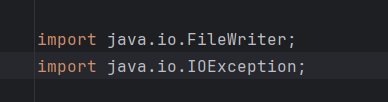

# Car Dealership Project

This Java project is a car dealership application that allows users to manage the sale and lease of vehicles. The program lets users record contract information, calculate costs, and save records to a file for reference. The system also provides different rules for sales and leasing and ensures that vehicles are only leased if they are under three years old.

# Features
# Record Sales and Leasing Contracts: 
Users can enter details for a vehicle sale or lease, including customer information, contract date, and vehicle details.
# Automatic Price Calculation:
For sales, the application calculates the total cost with taxes and fees and offers a financing option with calculated monthly payments.
For leases, the application calculates the expected ending value, lease fees, and monthly lease payments.
# Save Contracts to File: 
Each sale or lease contract is saved in a text file for record-keeping.
# Admin Features (Bonus): 
An additional feature allows admins to view saved contracts and review transaction history.

# Code Highlight

this code snippet is setting up the necessary imports to write to a file and handle any possible errors that might occur in the process.